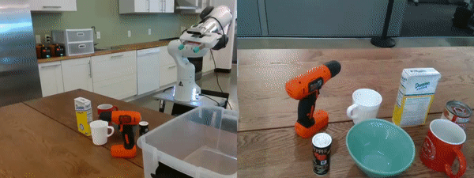
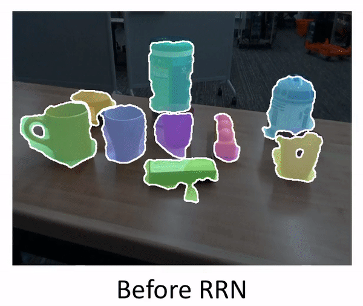

# The Best of Both Modes: Separately Leveraging RGB and Depth for Unseen Object Instance Segmentation

 

### Don't feel like compiling the Hough Voting Layer, or just want some better results? Checkout our new [UOIS-Net-3D  repository](https://github.com/chrisdxie/uois/tree/uois3d)!

This is the implementation of our unseen object instance segmentation network. Our instance segmentation algorithm utilizes a two-stage method to explicitly leverage the strengths of depth and RGB separately for stronger instance segmentation. Surprisingly, our framework is able to learn from synthetic RGB-D data where the RGB is non-photorealistic. Details of the algorithm can be found in our CoRL 2019 paper:

[Christopher Xie](https://chrisdxie.github.io), [Yu Xiang](https://yuxng.github.io), [Arsalan Mousavian](https://cs.gmu.edu/~amousavi/), [Dieter Fox](https://homes.cs.washington.edu/~fox/) <br/>
The Best of Both Modes: Separately Leveraging RGB and Depth for Unseen Object Instance Segmentation<br/>
In Proceedings of Conference on Robot Learning - CoRL, 2019

## Installation

We highly recommend setting up a virtual environment using [Anaconda](https://www.anaconda.com/distribution/) and [pip](https://pypi.org/project/pip/). Here is an example setup using these tools:

```bash
git clone https://github.com/chrisdxie/uois.git
cd uois/
conda env create -f env.yml
```
In [env.yml](env.yml), we set `cudatoolkit=10.0` by default. Set the CUDA toolkit version to match the native CUDA version (in `/usr/local/cuda/`), since you must compile the hough voting code with corresponding CUDA compiler (`nvcc` is not provided with the `conda` `cudatoolkit` distribution). This can be checked with: `nvcc --version`. 

<span style="color:red">Note:</span> As of 9/24/19, it seems that PyTorch is not supported by CUDA 10.1. Please use CUDA <= 10.0. The code has been tested with PyTorch 1.0 and 1.2. 

### Hough Voting Layer

To install the Hough Voting layer (written in CUDA/C++), first install [Eigen](http://eigen.tuxfamily.org/). Eigen is a C++ template library for linear algebra, consisting ONLY of header files. This can be done from the Github source code and `cmake`:

```bash
git clone https://github.com/eigenteam/eigen-git-mirror.git
cd eigen-git-mirror/
mkdir build/
cd build/
cmake ..
sudo make install
```

If you do not have sudo access, do not run `sudo make install` and simply edit [setup.py](src/hough_voting/setup.py) to point to the directory where the Eigen headers live (e.g. `<ROOT_DIR>/eigen-git-mirror/`). 

<span style="color:red">Note:</span> The code has been tested with commit 4b2884.

Next, run the following line:

```bash
conda activate uois
cd <ROOT_DIR>/src/hough_voting/
python setup.py install
```

Make sure that `cudatoolkit=...` is set to the native CUDA version (in `/usr/local/cuda/`) which will be used to compile the CUDA code. Otherwise, the compiled CUDA/C++ code may not be compatible with the conda-installed PyTorch.

## Models
You can find the models [here](https://drive.google.com/uc?export=download&id=19wW-lfsGHRwQlwVnYhwrh5a4LhnZPYZA). We provide a Depth Seeding Network (DSN) model trained on our synthetic Tabletop Object Dataset (TOD), a Region Refinement Network (RRN) model trained on TOD, and an RRN model trained on real data from the [Google Open Images Dataset (OID)](https://storage.googleapis.com/openimages/web/download.html).

## How to run the network

See [uois_example.ipynb](uois_example.ipynb) for an example of how to run the network on example images. In order to run this file, Jupyter Notebook must be installed (this is included in `env.yml`). If you haven't used Jupyter Notebooks before, [here](https://www.dataquest.io/blog/jupyter-notebook-tutorial/) is a tutorial to get you up to speed. This repository provides a few images in the [example_images](example_images/) folder. 

Notes:

* Make sure to activate the Anaconda environment before running jupyter. This can be done with ``` conda activate uois; jupyter notebook ```
* the notebook should be run in the directory in which it lives (`<ROOT_DIR>`), otherwise the filepaths must be manually adjusted.
* After downloading and unzipping the models, make sure to update `checkpoint_dir` in [uois_example.ipynb](uois_example.ipynb) to point to the directory where the models live.

## Train the network
We provide sample training code in [train_DSN.ipynb](train_DSN.ipynb) and [train_RRN.ipynb](train_RRN.ipynb). We have not released our dataset; however, we have included [data loading](src/data_loader.py) and [data augmentation](src/data_augmentation.py) code in this release to help users get started training the network on their data.

## Citation
Our code is released under GPLv3.

If you find our work helpful in your research, please cite our work.

```
@inproceedings{xie2019uois,
author    = {Christopher Xie and Yu Xiang and Arsalan Mousavian and Dieter Fox},
title     = {The Best of Both Modes: Separately Leveraging RGB and Depth for Unseen Object Instance Segmentation},
booktitle = {Conference on Robot Learning (CoRL)},
year      = {2019}
}
```
